# 根本理解

**有关前端的所有东西都是由需求决定的，不可能存在无用的东西，一个事务，一项技术会出现，必然是由需求来推动的，一个东西他会存在就必然是为了解决某种问题，实现某种功能**


- 使用其他的封装框架就要有踩坑的觉悟，有些时候即便看起来是没问题的东西，但他还是有坑


# 基础

## 浏览器


- Chrome
- IE
- Firefox
- s


## ES6

- 1 - 函数相关

```js
// 1 - 箭头函数
() => {
    // 各种参数的写法
}

// 2 - 默认参数
(a, b, c=1, d=0) => {
    // 默认参数必须是倒数的形参上，否则没有意义
}

// 3 - rest参数
(a, b, ...rest) => {
    // rest 参数包含了所有超出前面形参接受范围的参数
    // 使用了 rest 就不会存在 参数丢失
}
```


- 2 - 模板文本、多行字符串

```js
// 
`${参数}
可以多行`
// startsWith
// endsWith
```


- 3 - 解构赋值

```js
// 使用 {} [] ... 进行解构展开
// Array.from()
// forEach
// includes()
```


- 4 - 块作用域

```js
// 会造成死区
// 不可重复定义，没有变量提升，
// 不能 window 调用
// let
可修改
// const
不可修改
```


- 5 - Enhanced Object Literals （增强的对象文本）

```js
// 属性简写
// 变量  函数
obj = {
	a,
    b,
    c(){
        console.log('函数简写')
    }
}

// 可动态计算的属性名
```


- 6 - set对象

```js
// 去重 伪数组
new Set(arr)
// 转数组  -- 2种
1. [...set]
2. Array.from(set)

trim()
```


- 7 - Symbol对象

```js
// 构造独一无二的数据
let a1 = Symbol('1')
let a2 = Symbol('1')
a1 === a2  // false 

// 使用同一个值
symbol.for()
// 返回记录值
symbol.keyFor()
```


- 8 - Promises对象

```js
//
```


- 9 - async/await

```js
// 异步操作
```


- 10 - Classes

```js
//
```


- 11 - Modules（模块）

```js
//关键字 export import
// export default                    import a from './ss.js'
// export const abc                  import { abc } from './ss.js'

// as 加别名
// * 全部导入
```


- 12 - fetch（）

```js
// fetch
// 一个新的请求api，替代xhr，不用创建，直接调用就可以了
// 第一个参数必须是一个完整的 url 地址，第二个是一个可选参数init/options（对象类型）
// fetch 默认是get 方式，要 post 方式可以在 init 中进行设置，也可以选择配置其他的参数
// 这个方法返回的是一个promise对象，注意进入then/catch中的情况（存疑），并不4xx 这种状态码就会进入到catch中，只有请求出现了错误才是进入到catch中， 4xx的错误信息会进入到then中，同时修改（一个指示位）的true/false 来确定状态
// 而且 fetch 请求时不会默认附带 cookie 信息的，需要时可以配置
```


Proxy

```js
//
```


AMD，RequireJS，CommonJS

```js
//
```


## W3C标准

- 这并不是某一个标准的称呼，而是一些标准的集合
- 网页构成（三个部分）
  - 结构（Structure）XHTML和XML
  - 表现（Presentation）CSS
  - 行为（Behavior）W3C DOM、 ECMAScript

## HTML5

 多设备，跨平台，减少对于插件的依赖（ Flash和Silverlight ），增加了一些新标签以及一些语义化标签，有利于 SEO ，canvas增强绘图功能

兼容（IE9以下几乎全不行）


### 语义化

header、footer、nav、article、section、strong、、、


### nodetype

```js
1-ELEMENT 
2-ATTRIBUTE 
3-TEXT 
4-CDATA 
5-ENTITY REFERENCE 
6-ENTITY 
7-PI (processing instruction) 
8-COMMENT 
9-DOCUMENT 
10-DOCUMENT TYPE 
11-DOCUMENT FRAGMENT 
12-NOTATION 
```


### 自定义属性


### mate标签


## CSS3

99年开始编辑，01年5月完成草案并开始

### 新增特性

-  CSS3 相比 CSS 2 对边框、背景、渐变、文本效果、字体、转换效果、过渡、动画、图片、用户界面、盒模型、媒体查询等都有了很大的改进，新增了不少功能和属性 

```js
// 边框
border-radius
box-shadow
border-image // 一些地方需要前缀 webkit- 或者 o- // ie不支持 border-image
```

```js
// 盒子阴影
box-shadow: 水平位置 垂直位置 模糊距离 大小 颜色 方向（默认是从里往外，设置inset就是从外往里）
```


```js
// 背景
background-image
background-size
background-origin
background-clip  // content-box, padding-box,或 border-box

```


```js
// 渐变 gradient
可以和一些参数配合产生不同的效果（线性，径向渐变）
linear-gradient	
radial-gradient	
repeating-linear-gradient	
repeating-radial-gradient

```


```js
// 文本效果
text-shadow
box-shadow

text-overflow 
// text-overflow: clip|ellipsis|string;
// 文字在一行内显示时，超出的处理（修剪，使用省略号，使用指定字符）

word-wrap
word-break
```


```js
// 转换
2D
3D // ie要求高10
```


```js
// 过渡/动画
ie要求高 10
```


```js
// 媒体查询/弹性盒子
box-sizing  // ie8
resize/outline-offset // 不兼容

```


### BFC

- 块格式化上下文（一种功能或者特性）

  - 使内部浮动元素不会到处乱跑
  - 和浮动元素产生边界

- 很多属性可以触发bfc

```js
根元素或其它包含它的元素

浮动元素 (元素的 float 不是 none)

绝对定位元素 (元素具有 position 为 absolute 或 fixed)

内联块 (元素具有 display: inline-block)

表格单元格 (元素具有 display: table-cell，HTML表格单元格默认属性)

表格标题 (元素具有 display: table-caption, HTML表格标题默认属性)

具有overflow 且值不是 visible 的块元素，

display: flow-root

column-span: all 应当总是会创建一个新的格式化上下文，即便具有 column-span: all 的元素并不被包裹在一个多列容器中。

一个块格式化上下文包括创建它的元素内部所有内容，除了被包含于创建新的块级格式化上下文的后代元素内的元素。
```

- 没有一种明确的定义，只能举例说明


### BEM

- 为实现模块化 css 的一种命名规范

- B - block：块

- E - element：元素                '__'

- M - modifier：修饰符           '--'
```js
// search-form__button--size-s  
// article__button--success

// 有时一个单词不够描述，所以使用 - 连字符作为一个整体

// less为例
// 这种写法不是嵌套写法，而是合理使用 less 工具的一种简便形式
.article {
    max-width: 1200px;
    
    // 在 & 后直接加连字符，不是层叠嵌套了，类似于字符串的拼接
    &__body {
        padding: 20px;
    }
    &__button {
        padding: 5px 8px;
        &--primary {background: blue;}
        &--success {background: green;}
    }
}
```

 

```js
// B - 
css 样式是否使用一些全局的改变，padding position等（存疑）
```


```js
// E -
```


```js
// M - 
```

局部作用域

- 不使用标签选择器，只使用 class 名来定义样式
- 不层叠多个 class，只使用一个 class 把所有样式定义好，要class竞争
- 所有样式通过 `composes` 组合来实现复用
- 不嵌套，不干扰其他元素
- 即便是后台元素，也直接跟在 块名称 之下，不做嵌套或名称叠加

解决冲突，

只看css时要了解到足够的信息


### 盒子居中

- flex

- margin - transform

- margin 0 0 0 0 ,auto

- 定位

- ```
  position: absolute;
  top: 0;
  left: 0;
  bottom: 0;
  right: 0;
  margin: auto;
  ```

- ```
  position: absolute;
  top: 50%;
  left: 50%;
  margin-top: -50px;
  margin-left: -50px;
  ```


### 盒子模型

- 把所有的html元素都看作一个盒子，他们包括：内/外边距，边框，内容（W3C/IE两种盒子模型只是对width/height属性的区分不同，**不是width/height包住的部分才是盒子**）
  - W3C标准盒子模型  -- 向外的（默认）                                ----             content-box
  - IE怪异盒子模型 -- 向内的（到border，只除外margin）  ----             border-box


### 动画

使用关键词定义

调用

有动画结束方法


## JS

是否面向对象

### 组成部分

- ECMAScript: (3/5/6/7)它是JS语言的标准,规定了JS的编程语法和基础核心知识

- DOM: document object model 文档对象模型,提供给JS很多操作页面中元素的属性和方法

- BOM: browser object model 浏览器对象模型 ,提供了很多操作浏览器的属性方法,而这些方法都存放在window浏览器对象上


### 数据类型（7种）

- underfined
- null
- object
- string
- number
- boolean
- symbol(ES6新增)：symbol值是独一无二的

```js
// Symbol 用法
let ss1 = Symbol()    
let ss2 = Symbol("sss")
let ss3 = Symbol("sss") 
// 可传参，也可不传   ---  无论传不传，怎么传，都是不一样的
// 不传参，虽然也是独一无二的，但在控制台显示的都是 Symbol(),没有辨识度

// 2 - 转换
// 可以转为字符串，布尔值
// 不可以转数字
// 不可以参与运算（加减乘除， ** 拼接 **）（转为字符串可以拼接）

// 3 - 使用同一个值     ----   Symbol.for()
let a1 = Symbol.for('a')
let a2 = Symbol.for('a')
a1 === a2                      // true

let a1 = Symbol.for()
let a2 = Symbol.for()
a1 === a2                      // true

// 4 - 返回已登记的key值 ----   Symbol.keyFor()
// Symbol.for 有参数
let a1 = Symbol.for('a')
Symbol.keyFor(a1)              // "a"

// Symbol.for 无参数
let a1 = Symbol.for()
Symbol.keyFor(a1)              // undefined

// 无 Symbol.for 表明未登记
let a1 = Symbol()
Symbol.keyFor(a1)              // undefined
```

- JS中的所有数字（number）类型的数字都是浮点数


### Blob对象

数据分块

- 构造函数 -- Blob(blobParts[,  options\])
  - blobParts：数据，buffer流或者字符串
  - options：文件选项，type:mime(文件类型) ...
- Blob.size
- Blob.type
- Blob.slice()


### this指向


### xhr

- readyState

```js
- 0 - 未初始化：尚未调用 open 方法

- 1 - 启动：已调用 open 方法，还未 发送 send

- 2 - 发送：已经发送 send 还未接收到响应

- 3 - 接收：开始接收，接收到了一部分数据，不全

- 4 - 完成：已经完全接收到了全部的响应数据，可以使用了
```


## XML

- 可扩展标记语言

```js
// 1 - 必须声明
<xml version = "1.0" encoding="utf-8"?>

// 2 - 严格区分大小写

// 3 - 一定要闭合（单双两种方式的闭合）

// 4 - 只有一个根节点

// 5 - 属性值必须加引号（推荐双引号）
     
// 6 - 可以自定义标签
```


## 模块化/组件化

这两个的关注点不一样一个是隔离封装，一个是重用解耦


- 模块化

```js
// 横向，分块 -- 多个模块就可以组成一个产品
// 常用一个词 -- **功能模块**，模块是把同一类代码放到了一起，这些代码都是为了解决某种业务逻辑的
// 简单的理解，可以说一个vue文件就是一个模块，里面的各种函数，各种html标签，都是为了同一类功能而存在的

// 高内聚，低耦合
// 封装，隔离
```


- 组件化

```js
// 纵向，分层 -- 可以有多个组件组合使用，可分层
// element-UI 组件库，多种组件可以结合在一起，形成一个组件
// 一个 el-··· 就是一个组件，一般页面都需要各种各样的 el 组件来行成一个页面

// 高重用，低耦合
// 重用，解耦
```


## 设计模式

有单例模式，工厂模式，策略模式，代理模式，观察者模式，模块模式，构造函数模式，混合模式 7 种

- 单例模式

  ```js
  // 单例模式
  // 只存在一个实例，就算多次调用这个构造函数，多次创建，得到的结果也是同一个
  let p1 = new Person()
  let p2 = new Person()
  // 普通模式下 p1 === p2  false
  // 单例模式下 p1 === p2  true
  // 单例模式使用了闭包，保存了已经创建出来的东西，并且在再次调用构造函数时，会比较是否已存在，同一个，如果存在则返回原来的东西
  // 使用闭包来实现一个密闭空间，不能直接访问而且不能设置修改
  
  // 单例模式一般用于创建全局变量，如 window 这种只有一个的全局变量
  ```

  

- 工厂模式

  创建型设计模式，不通过做判断来调用不同的函数，而是直接传参来确定用什么函数

  ```js
  // 简单工厂模式
  // 通过传入不同的角色参数，确定使用什么构造函数进行创建
  // 存在很多构造函数，使用工厂类来判断并进进行分发
     
  // 工厂方法模式
  // 这是对简单工厂模式的一种优化
  // 
     
  // 抽象工厂模式
     
  ```


# 页面


## Canvas

用 canvas 画一个时钟，并且可以动

- 要有 canvas 标签，获取这个 dom 节点，用于调用 getContext('2d') 方法，获得一个  CanvasRenderingContext2D 对象，之后的一切操作将基于这个对象（webgl => 3d）

- canvas 的主要方法不多，主要是 画线条的方法，画圆形的方法，以及一些填充的方法，往内部空间填充背景图片，颜色等


## iframe


## Less

```js
// 注释
// 不编译到css中
/**/ 编译到css中
```
```js
// 变量
// 可以定义自己独立的命名空间

```
```js
// 嵌套


```
```js
// 
```
```js
// 
```
```js
// 
```
```js
// 
```
```js
// 
```
```js
// 
```
```js
// 
```


## 布局

- 媒体查询
- 流式布局
- rem布局
- flex布局
- 响应式布局


# 框架

- 使用框架应注意，框架也是人封装出来的，内部的东西可能会经常改而造成某种不可预期的bug，对于一些可能看起来显而易见的逻辑也可能会有错（v-bind 中真值判断，不是所有的 falsy 值都被判定为 false）

## Bootstrap


## jQuery

write less， do more

- 链式编程（方法中返回的是this，dom元素的引用就还可以链式编程，但操作时返回一个其他的值的时候就不可以了，这个整体不再代表dom了。如：text()：返回的是元素内部的值，不能再链式了，text('设置值')：返回的依旧是dom指向，可以继续链式）
- 隐式迭代

- pipe


## Vuejs

### MVVM

### nextTick(fn(){})

- 当数据视图（浏览器重新渲染之后会立即执行回调函数中的代码）

- 主要适用对象是 dom操作，希望在dom更新之后做一些 dom操作（例如：在新增了一个dom元素之后，修改dom的位置）

- 使用：需要在数据改变之后操作 **DOM** 的时候，最好把 dom 操作放到nextTick的回调函数中，因为vue框架的数据更新视图是有许多内部执行代码的，而且是异步去执行的，当我们要修改dom的时候，可能并不是我们所期待的那个 dom（就如created钩子函数一样）


### 插槽


### watch/computed

- 监听和计算属性的区别
- 计算属性会依赖其他的值，当因为所依赖的值发生改变而导致计算属性的改变时，计算属性的视图也会更新，一定要返回 return，无法传参，也就是说要使用 this 中的值。尽量只使用简单的逻辑，在复杂逻辑下，可以使用方法 （缓存）


### 动态路由

- 由：传参的动态路由
- 根据用户登录权限来动态生成整个路由表
  - 使用 addrules（存疑）
  - 在添加动态路由之后还要注意 是否需要 push 进入某一个默认的路由，直接添加完路由表之后，不知道会不会自动进入原来选中的路径（因为权限的存在，a，b两个用户不允许相互访问各自的特有路由，在最初的登录访问过程中，本该直接进入默认路由，但是，这个用户的路由是根据用户权限来动态生成的，也就是说在地址栏输入地址路由时，还没有路由表，之后根据一些信息生成了，但这个时候路由已经写好了，不确定会不会访问，就像同步请求一样，一个请求已经返回了，这个时候没有监听函数，当返回完了之后才开始创建出来监听函数，这时已经失效了， **这个地方的push就是这个作用（存疑，未测试））


### 路由(导航)守卫

也称路由钩子

- 全局导航守卫
  - 全局前置守卫： router.beforeEach(fn) 
  -  全局后置守卫：router.afterEach(fn)
- 路由独享守卫
  -  beforeEnter：fn(to, from, next) {}      -- 作为组件的一个组件形式来进行设置
- 组件内守卫
  - 写在组件内部，作为实例选项的存在


```js
// to：表示要去哪里
// from：表示从哪里来
// next：表示通不通过

- router.beforeEach(fn) 
- router.afterEach(fn)

// next() 等价于 next( true ) 表示可以从当前路由跳转到目标路由
// next( false ) 表示不通过， 表示从当前路由跳转不到目标路由
// next(’/login’) 等价于 next({path:’/login’}) 跳转指定的路由
// next(’/login’) 等价于 next({path:’/login’,params,query})
// next( fn ) 数据预载
```


### 数据劫持

- 使用Object.defineProperty() 来实现数据劫持 （js原生的方法）

```js
// Object.defineProperty()
Object.defineProperty(obj,prop,descriptor)

// obj:目标对象

// prop:需要定义的属性或方法的名称

// descriptor:目标属性所拥有的特性
// 可供定义的特性列表 ------------
// value:属性的值
// writable:如果为false，属性的值就不能被重写。
// get: 一旦目标属性被访问就会调回此方法，并将此方法的运算结果返回用户。
// set:一旦目标属性被赋值，就会调回此方法。
// configurable: 如果为false，则任何尝试删除目标属性或修改属性性以下特性（writable, configurable, enumerable）的行为将被无效化。
// enumerable: 是否能在for...in循环中遍历出来或在Object.keys中列举出来。
```

- 从特性列表中可以发现，当我们访问或设置对象的属性时都会触发对应的函数（get，set）然后在这个函数里返回或设置属性的值，那么我们是否可以在这个触发的函数中定义一些自己的东西，来达到一下效果，**这就是劫持** （vue是采用这种方式）

```js
// 劫持
var data = {
    name:'lhl'
}

Object.keys(data).forEach(function(key){
    Object.defineProperty(data,key,{
        enumerable:true, // 是否能在for...in循环中遍历出来或在Object.keys中列举出来。
        configurable:true, // false，不可修改、删除目标属性或修改属性性以下特性
        get:function(){
            console.log('get');
        },
        set:function(){
            console.log('监听到数据发生了变化');
        }
    })
})；

data.name //控制台会打印出 “get”
data.name = 'hxx' //控制台会打印出 "监听到数据发生了变化"
```

- 数据劫持在遇到数组时，会重写数组的原型，实现数据绑定，正因如此，vue对数组的绑定有一点小缺陷，对于**某一数据项**或**数组长度**变化时，无法监听到。(因为vue无法监听到对象属性的动态添加)
- 在需要对数组和对象进行添加操作时一定要小心，数组可以使用官方文档中可以引发数据更新的方法

```js
//  Vue 不允许动态添加根级响应式属性（官方解释）
// 对象属性的添加，推测，这样的添加绕过了 vue 的绑定机制
export default {
    //
    data(){
        return {
            obj:{}
        }
    },

    //
    mounted() {
        this.obj = {d: 0}; // 存疑，
        this.obj.e = 0;    // 不行
        console.log('after--', this.obj);
    },

    //
    methods: {
        //
        addd(item) {
            item.d = item.d + 1;
            console.log('item--',item);
        },
        
        //
        adde(item) {
            item.e = item.e + 1;
            console.log('item--',item);
        }
    }
}
```

- 解决办法 set( ) 方法

```js
// set 方法
Vue.set(vm.obj, 'e', 0)

this.$set(this.obj,'e',2)
```


在vue3中可能不会再使用 difineproperty()方法，而使用proxy对象方法（es6新增、代理）

```js
// 可以代理对象的所有属性
// data 目标对象
// 第二个参数 配置对象
// 		get 访问器
// 		set 赋值器
new Proxy(data, {
    
	get (target, property) {
	
    },
    set () {
        
    }
})
```


### EventBus

新建另一个 Vue 实例来抛出和监听，使用代码抛出事件和代码监听事件技术

$emit

$on


### 钩子函数

- 要时刻注意组件，钩子函数（重点created）的状态，组件如果只是隐藏而不是重新渲染的话，钩子函数（重点created）是不会在执行的
- 钩子函数的必要性：不同于原生js，在vue中vm是一个对象，所有的操作都是他的一个属性/子集属性，也就是说在这个实例里是不存在函数的执行空间的（对象内不能调用函数），没有钩子函数就意味着只有在用户进行了一些操作的时候，才会有触发函数的执行空间，所以催生了钩子函数的出现，可以在里面自由的调用函数，实现初始化等效果


### 组件缓存

移动端使用会多一点


### Vuex

- 使用的单例模式所提取出来的一种数据共享管理状态

- 就是对共享数据的读取和修改

```js
// 改变 state 中状态的唯一方式是 显式的提交（commit）一个 mutation（官网建议的，只有这样数据才可以被动态的检测到，虽然直接修改可是可以的，但不建议，这样做就失去了意义）
// 可传参
new Vuex.store({
    state: {
        counts: 1
    },
    
    // 获取
    getters: {
        getCounts() {
			return state.counts
        }
    },
    
    // 设置 - 同步  -- commit(在外部进行调用的时候)
    mutations: {
        // 唯一的直接调用，操作 state 中数据的方式
        // 必须使用 mutation 中 方法才可以在 vue调试工具中看到动态值
        addCount(state) {
			state.counts = state.counts + 1
        }
    },    
    // 设置 - 异步  -- dispatch
    actions: {
        // 这里对 state 中的数据进行设置也要经过 mutations commit
        addCount2(context) {
            context.commit('addCount')
        }
    }
    
    
})
```


- 热重载
- 


## Vue2（新特性）

- 只有 Vue Router 2 与 Vue 2 保持兼容（Vue Router 1必须升级）

- Vuex 0.8+ 与 Vue 2 保持兼容（可部分）

- 可以理解为 Vue2 在向着对用户更加友好的方向发展，去除了一些过于复杂且低效的东西，能够用js原生方案解决的问题就不再过多的调整

  

```js
// 1 - 模板
// 改 - 每个组件必须只有一个根元素
// 原 - 不再支持片段（多个兄弟节点）
```

```js
// 2 - 钩子函数（增删，改名）
// 一些与监听 DOM 的钩子函数移除/修改了，添加使用 this.$nextTick() 回调来对 DOM 进行操作
```

```js
// 3 - v-for（显式对象，参数顺序，key名字）
// 修改了参数的顺序
// track-by 改名为 key
// 取消了 $key 和 $index 内置对象，必须显式的调用item.
```


```js
// 4 - props
```


```js
// 5 - 计算属性
```


```js
// 6 - 过滤器（减小范围，: {{ }}, 删除内置过滤器，this不再指向）
// 内部的 this 不再指向 vue 实例，与 vue 参数解耦，只能传参获取（从第二个参数开始，第一个参数是 | 前的数据）
// 参数的设置形式改变，要求有() 进行包装
```


```js
// 7 - v-el、v-ref
// v-el 和 v-ref 合成了一个 ref属性，通过 this.$refs 进行调用
```


```js
// 8 - v-else、v-show
// 不再同时使用，只出现一个，通过添加判断条件来实现原有效果
```


```js
// 9 - keep-alive
// 缓存，不再是一个属性，而成为了一个标签
// <keep-alive>  </keep-alive>
```


```js
// 10 - $
// 很多 vm.$... 方法被移除，对于一些原本操作 DOM 的方法，只能直接使用原生js操作 DOM 的方法
// vm.$data 被移除，不允许这么直接访问
```


```js
// 11 - v-blid 绑定值
// 真假值判定改变， 只有 false underfined	null，被看作是假（0 ‘’ 将被当作真值）
// 其他指令的判断依旧不变，
// ** 由此可以发散思维，对于别人封装的一些东西(网上开源的框架，组件)，注意这种‘坑’，要有这种可能是框架的问题导致了某种不可预期的结果，他可能今天是这样，明天是那样 **
```


```js
// 12 - 
```


## React


## nodejs

### token

- **jsonwebtoken**

  1.是使用外部插件，通过对需要验证的用户的信息（如用户名，密码，如有需要可以添加其他的数据）**进行加密**来产出一条特定的，包含用户信息的字符串，当后台对这个字符串进行解析时，会获得用户的验证信息，可以表征用户（加密过程中有自定义的密钥  secret）

  2.前台的每一次请求的提交都将带着token，而不是用户的验证信息（只在登录时使用了一次），更安全，更方便，不用再前端设置变量来保存用户名和密码

  3.返回给前台的数据只要包含加密后的字符串即可，是否添加其他字符串无所谓
  
  ```js
  // 产生的字符串由两个 . . 分为三个部分 Header（头部）.Payload（负载）.Signature（签名）
  const jwt = require('jsonwebtoken')
  // xzk123456 => d3902712e44943de8a81021bcafb0330 
  let token = jwt.sign(
      {user: 'xzk',password: 'xzk123456'}, 
      'xzs', 
      {expiresIn: 60 * 60});
  
  console.log(token)
  
  console.log('-----------------------------------------')
  
  jwt.verify(token, 'xzs', function (err, data) {
    if (err) console.log(err)
    console.log('解析的数据', data)
  })
  
  ```
  
  

```js
// 1 -- header 加密算法， 与 token 类型 
{
  "alg": "HS256",
  "typ": "JWT"
}

// 2 -- payload 存放一些信息，设置（过期时间）
// JSON 对象，有官方字段也有可以有用户自定义，exp (expiration time)：过期时间
// 用户自定义的信息不会加密（要注意不防止私密信息）
iss (issuer)：签发人
exp (expiration time)：过期时间
sub (subject)：主题
aud (audience)：受众
nbf (Not Before)：生效时间
iat (Issued At)：签发时间
jti (JWT ID)：编号

// 3 -- signature 签名，加密的主要部分
// 使用一个私有密钥，secret 在用 header中的 alg 签名算法进行加密

HMACSHA256(
  base64UrlEncode(header) + "." +
  base64UrlEncode(payload),
  secret)
```


### RESTful

- 一种后台（接口）设计规范
  - 每一个URI代表1种资源；
  - 客户端使用GET、POST、PUT、DELETE4个表示操作方式（有时有HEAD 和 OPTIONS）


### 中间件

- use((req, res, next)=> { })  -- 中间件放置的位置有影响，一定要注意next的使用，不能让正常的流程被卡住


# 工具

## Webpack

### 原理

- 一款静态模块打包工具（运行在nodejs中）（没说是vue的打包工具，所以应该要兼容所有的框架项目打包方式）
- 通过书写js文件来生成配置，所以必然在webpack中会有地方调用到这个js文件，所以要到处一个对象，通过设置对象的各种属性来实现多样化的配置（可以同理到其他的工具中）
- webpack之前也有类似的工具，统称任务执行器，把所有的配置文件都拼接到了一个文件中，复用性高，但难以优化和延迟加载（按需加载）（node的出现解决了这个问题，模块化方式的出现）
- entry、output、loader、plugin、mode（D/S）、browser compatibility
- webpack模块能够支持用户以**各种方式**来表达文件之间的依赖（换句话说就是webpack可以识别各种各样的文件引入方式，并且在打包的时候将他们封装到一起）
  - 使用 import语句
  - CommonJS：require语句
  - AMD：define 和 require 语句
  - css/sass/less 文件中的 @import 语句。
  - 样式或 HTML 文件中的图片链接
- **重要组成：**loader、plugin
- loader：对模块的源代码进行转换，可以直接使用非JavaScript语言的东西（如less）
  - plugin：插件（用于解决loader无法解决的其他事）（比如生成文件...）
- 入口
```js
// entry 入口 -- 从那个文件开始解析项目并开始生产模块
module.exports = {
    // entry: string|Array<string>
    // 也可以属性后带一个数组 { main:[] }

    // 单文件配置 - 简写
    entry: './path/to/my/entry/file.js'
    // 单文件配置
    // entry: {
    // 	 main: './path/to/my/entry/file.js',
    // }
};
// 对象语法
module.exports = {
    entry: {
        app: './src/app.js',
        adminApp: './src/adminApp.js'
    }
};
// 多页面应用 -- 不同于但也应用的路由跳转，而是会请求一个新的文件/资源过来
module.exports = {
    entry: {
        pageOne: './src/pageOne/index.js',
        pageTwo: './src/pageTwo/index.js',
        pageThree: './src/pageThree/index.js'
    }
};
```


- 出口  

```js
// output 出口 -- 如何向硬盘中写入文件，只能由一个配置（与只能写一个文件有差别，可以写出多个文件，但是关于output的配置只能有一个）
// 最低要求是一个对象，只一个 filename 属性，**不能**直接写一个字符串默认是filename
output: { filename: 'bundle.js' }

// 对应多个入口起点，并且想放到不同的文件中（可以选择放到同一个文件，只是一般不会，没意义）
output: {
    filename: '[name].js',
    path: __dirname + '/dist'
}
// 动态设置 -- 高级进阶
output: {
    // 留空 到后面来确定
    path: '/home/proj/cdn/assets/[hash]',
    publicPath: 'http://cdn.example.com/assets/[hash]/'
}
__webpack_public_path__ = myRuntimePublicPath; // 入口起点中
```


- 模式
```js
// model
mode: 'production'/'development'/'none'
// 选择前两种是，webpack会有对应的已经经过合理优化的一些配置
// 选择none将会取消所有优化配置

// -- development -- 启用
// NamedChunksPlugin
// NamedModulesPlugin

// -- production --  启用
// FlagDependencyUsagePlugin
// FlagIncludedChunksPlugin
// ModuleConcatenationPlugin
// NoEmitOnErrorsPlugin
// OccurrenceOrderPlugin
// SideEffectsFlagPlugin
// TerserPlugin
```


- loader
```js
// loader
// 链式传递，一个一个往上传，最后一个loader返回webpack中期望的js
// webpack 只能理解 JavaScript 和 JSON 文件，使用 loader 来处理
// 在vue中的less文件就可以直接用到了style中或者直接引入到main.js中，而不是人为的转成css文件来引入，loader帮我们做了
// module 属性  ---  rules 属性
// test -- 对什么文件
// use -- 用什么loader
module: {
    rules: [
        { test: /\.css$/, use: 'css-loader' },
        { test: /\.ts$/, use: 'ts-loader' }
    ]
}
// 对应多个loader 从右往左，从下往上
module: {
      
    rules: [{
        test: /\.css$/,
          
        use: [
              { loader: 'style-loader' },
              {
                loader: 'css-loader',
                options: {
                  modules: true
                }
              },
              { loader: 'sass-loader' }
            ]
          
    }]
      
}

// 内联
import Styles from 'style-loader!css-loader?modules!./styles.css';


```


- plugin
```js
// plugin 插件
// 使用例子：是否生成一个新文件
// 一个具有 apply() 方法的 js 对象，该方法会被 webpack 中的 compier 方法调用，
```


- 配置
```js

```


### 流程

需要有 webpack.config.js 配置文件

webpack和vuecli是同一个原理，浏览器无法识别除了js等几种格式的文件，所以如果看到了使用模块化开发的东西，有.vue文件的这种项目，一定是需要打包的，而webpack就是这种打包工具，把各个模块的东西集成到一起进行解析


## Vue-Cli

cli 是一个开发环境依赖，构建于 webpack 和 webpack-dev-server 之上的

包含了：加载其他cli核心服务

​					一个优化过的 webpack 配置（针对于绝大部分的应用做了针对性的优化）

​					项目内部的 vuecli 命令，server，build，inspect


### 2.0

- vue  init webpack-simple heroes

- 询问一些基本信息之后就会直接创建项目，src中的东西不多，大多要自己补充，run 命令也可以自己设置
- 而且内部没有相关的依赖包，要在创建之后用户自己下载

### 3.0

- vue create 项目名（不能有大写）
- 是否默认
- babel,router,vuex,css,linter
  - babel：es6转es5
  
  - router：路由组件
  
  - VueX：状态管理

  - CSS：预处理器
  
  - linter：代码校验和格式化
  
    **特别注意：** 在这个选项中选择不同的模式将会影响到接下来的选项，理论上是可以一项都不选的，
  
- history模式（router影响）
- 预编译选择（less，sass...）（css预编译器影响）
- 代码校验风格（linter影响）
- 代码格式校验方式（linter影响）
- 配置文件生成（这个一定有）（整体生成还是单个生成）

```js
// 
src
 | App.vue
 | main.js
 | router.js (router)
 |- assets 静态资源
 |
 | store.js (store)
 |
 |- utils (asios请求包的引入，拦截器，默认接口地址)
 |- api (各种请求，针对不同的模块封装到不同的文件，按需导入导出)
 |
 |- components 非路由组件
 |
 |- views 路由级组件
 |- filters 全局过滤器(可能会需要，一些已经设置好的过滤器，复用性高的)
```


## 浏览器调试工具


json-server 使用的是 reful 接口规范，只接受post get push delete 接口方法


# 技术

## 浏览器

### 组成

一共有 7 个部分 - 用户界面、浏览器引擎、渲染引擎、JS引擎、UI后端、network(网络)、数据存储

- 用户界面

  ```js
  // 除了用来显示 html 部分的东西，前进/后退，书签，地址栏等
  ```

- 浏览器引擎

  ```js
  // 用来查询和操作渲染引擎的 **接口**
  ```


- 渲染引擎

  ```js
  // 常说的 内核
  ```


- JS引擎

  ```js
  // 用以解释、执行JS代码
  // V8、JavascriptCore
  ```


- network(网络)

  ```js
  // 用来完成网络调用，例如 http 请求的调用，与平台无关，可以在不同的平台上工作
  ```


- UI后端

  ```js
  // 绘制 对话框等基本组件，不同的浏览器对话框的样式不一样
  ```


- 数据存储

  ```js
  // 浏览器的存储，可以用于在多个标签页中进行数据交互
  ```


### 渲染

- 浏览器拿到html等相关文件之后，开始解析
  - 遍历创建 DOM 树
  - 遍历创建 CSS样式树
  - 组合 DOM 树和 CSS 样式树，生成 render 树（开始布局 layout）
  - 开始渲染


### 访问

浏览器解析主机域名，

前往本机中的hosts文件中查找是否有地址

前往dns查找，

返回


history.go	

### 缓存

- http缓存
  - 强缓存（不再请求服务器，200） Expires / Cache-Control
  - 协商缓存（请求服务器，200，304）  Last-Modify/If-Modify-Since或Etag/If-None-Match

```js
// http请求中有关于缓存的信息，是否使用缓存/  Expires / Cache-Control ...

// 强缓存
// 服务器会通知客户端一个时间，在这个时间内，请求都是缓存，不请求服务器，即便服务器数据有了更新，也不会请求服务器，只有时间失效之后才会走协商缓存，而且可能会返回 304

// Expires：缓存有效时间，**服务端响应**一个时间，是一个绝对时间，如果电脑本地时间修改的话会产出冲突

// Cache-Control：相对时间（优先级高于expires）
	// max-age: 设置方式：Cache-Control:max-age=31536000
	// s-maxage:
	// public: 共享的
	// private: 非共享的
	// no-cache: 发送验证器到服务器
	// no-store: 禁止缓存
```

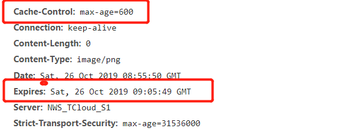


```js
// 协商缓存
// 一定会发送请求到服务器，请求中带有一些特定的状态码，以辨别服务器的数据是否有更新，更新了则返回请求内容 而且 200;
// 没有更新则返回 304，然后浏览器从缓存中取数据

// Last-Modify/If-Modify-Since
// 第一次响应会有一个服务器信息修改时间Last-Modify
// 再次请求时发送一个If-Modify-Since(其值为Last-Modify)，服务器判断是否修改，没改则是返回304

// Etag/If-None-Match （优先级高）
// Etag这个是校验码，资源改变则校验码改变，其余过程和时间的方式一样

// Etag
// Last-Modify只能精确到秒
// 有时时间改变但文档的实际内容并没有改变
// 返回的时间信息可能出错
```

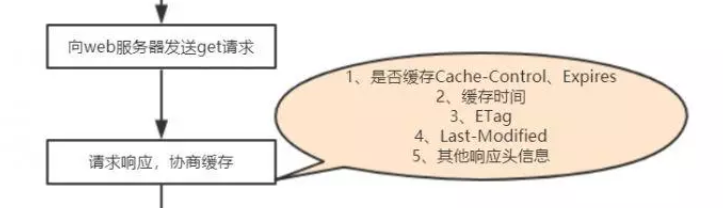


- 浏览器缓存
  - cookie（4K）
  - sessionStorage  -- (h5) 与后台交互，会话关闭，缓存失效（5M）
  - localStorage       -- (h5) 不与后台交互，手动删除（5M）


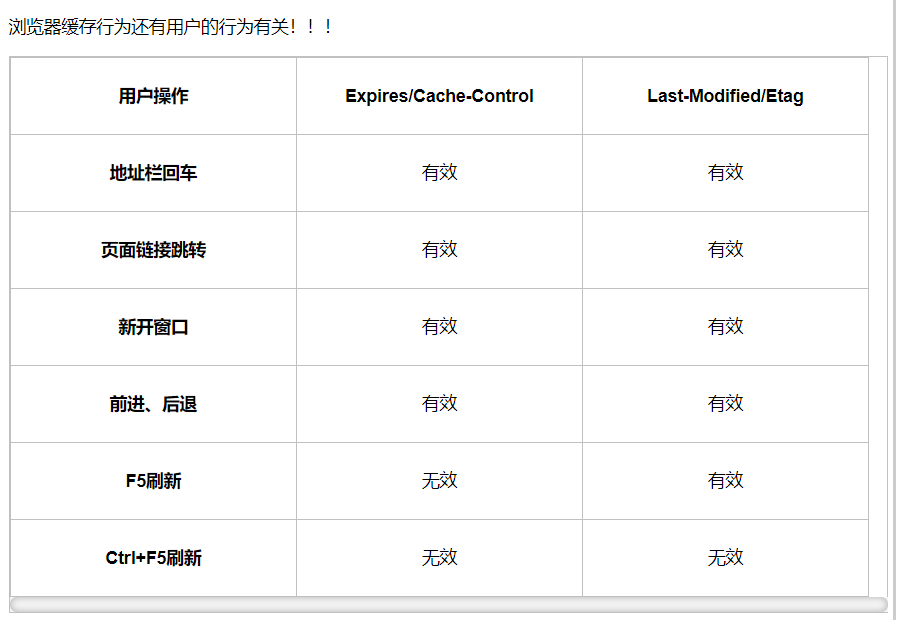

- 无效代表缓存无效，即无论什么情况，都会发送请求到服务器请求资源


## 跨域

- JSONP
- CROS（ Access-Control-Allow-Origin ）
  - 简单请求
  - 非简单请求
- 代理
  - node 主要使用http模块的 request 方法进行转发，配合一些中间件可以进行监听需要转发的接口或资源


## 协议

- 协议：一种双方协定好的规范，可以理解为一种翻译方式，如何解读对方发送过来的数据，包含了哪些含义

  - 语法：即数据与控制信息的结构或格式
  - 语义：即需要发出何种控制信息，完成何种动作以及做出何种响应
  - 同步：即事件实现顺序的详细说明

- 层级：协议分层

- OSI的7层从上到下分别是 7 [应用层](https://baike.baidu.com/item/应用层/4329788) 6 [表示层](https://baike.baidu.com/item/表示层/4329716) 5 会话层 4 [传输层](https://baike.baidu.com/item/传输层/4329536) 3 网络层 2 [数据链路层](https://baike.baidu.com/item/数据链路层/4329290) 1 [物理层](https://baike.baidu.com/item/物理层/4329158) ；其中高层（即7、6、5、4层）定义了应用程序的功能，下面3层（即3、2、1层）主要面向通过网络的端到端的[数据流](https://baike.baidu.com/item/数据流/3002243)。

  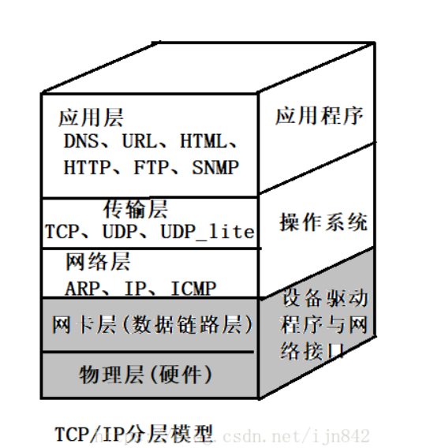

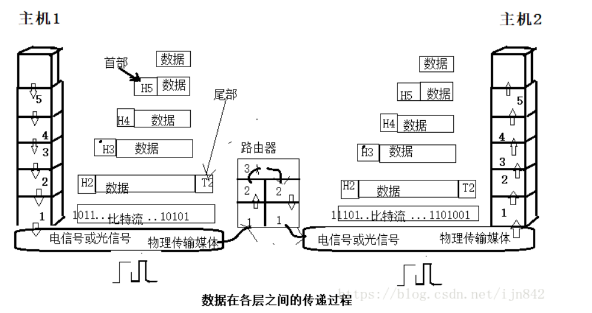

- 封装：开始传输时，没经一层就会为数据添加一个首部，包含了相关信息（用的什么上层协议，首部有多长，载荷有多长...）（自顶向下封装）
- 分用：把本层解析出来的信息交给上一层中的谁（自底向上交付）


### http

- 超文本传输协议
- 基于TCP的一种明文方式的传输协议，规定了请求以什么形式发送，应该接受到什么形式的响应信息（就是有关请求头，请求行，请求主体这些信息）

### https

- 超文本传输安全协议（HTTP over SSL）
- 这是一个应用层协议，在TCP传输层协议上，这里的握手和 TCP 的三次握手没有联系，或者说必须要完成了TCP的三次握手才会有后续事情的发生
- 使用了ssl解密，效率比http低，只有十分之一左右，但更安全，通过在三次握手的过程中发送ssl相关信息
  - 第一次 c => s，**交换**ssl协议版本，加密算法种类，随机数以及其他建立连接的信息
  - s => c，返回ssl协议版本，加密算法种类，随机数，以及服务器证书，客户端收到后进行验证，如果正确（是否过期，正确，能够根据公钥解开，服务器是否匹配）则开始第二次握手
  - 第二次 c => s，随机产出一个‘预主密码’(可以理解是加密算法的密钥)，通过服务器公钥加密，如果服务器也要验证用户，则还要添加用户证书信息（是否过期，正确，能够根据公钥解开数字签名，是否被废止）同时客户端也用一样的方式产生了‘主通信密码’
  - s => c，使用‘预主密码’通过一系列操作来产生‘主通信密码’（如hash算法加密，使用‘预主密码’作为密钥加密）
  - ... 结束握手


### WebSocket

- 服务器可以主动向客户端推送信息
- sicket.io
- on emit send 可以在发送的时候指定类型，那么只有对应的类型相应事件才能够监听到这个事件传过来的数据
- on 单播
- emit 广播（对于所有的对应类型的连接上的都会接收到）


## 请求

### 三次握手/四次挥手

- 三次握手

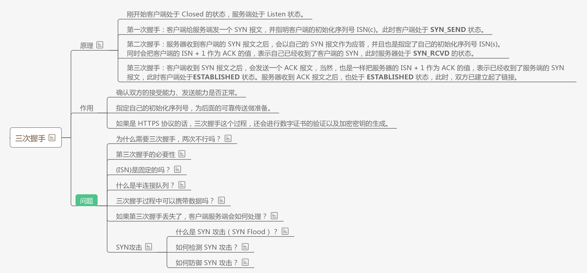

- 四次挥手

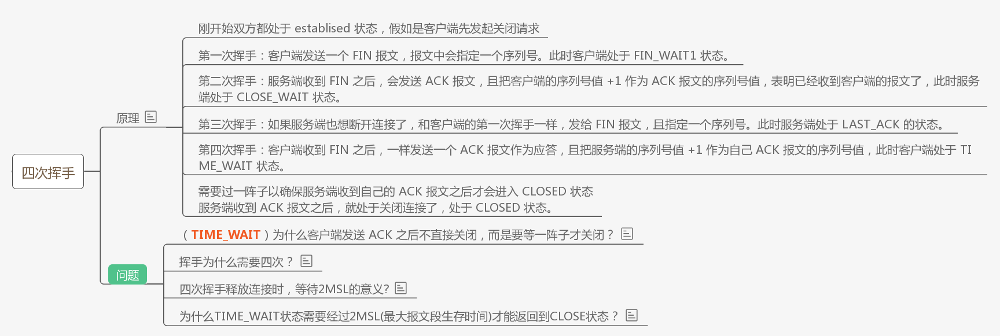

- 总结

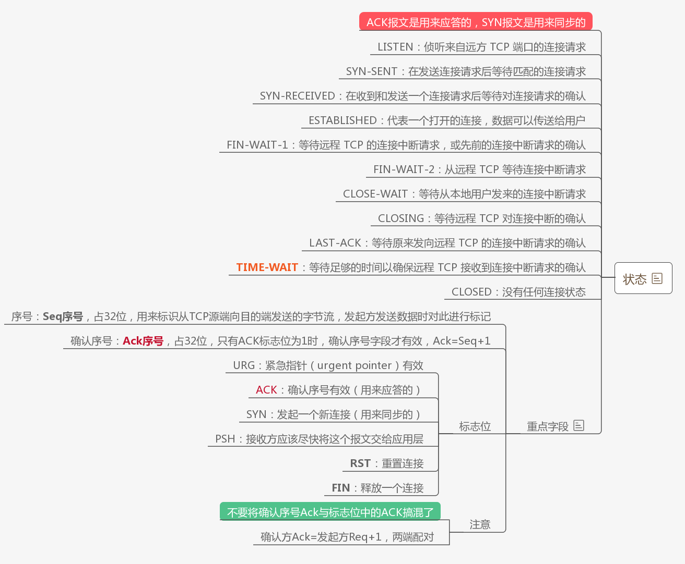


- 三次握手的必要性是为了让客服端与服务器相互确认对方的发送的接收能力正常


### 推送

> 通过客户端与服务器端建立长连接，客户端可以实时接收来自服务器不定时发送的消息

- 传统：Ajax Polling（短轮询）

- Comet
  - Ajax  Long-polling（长轮询）
  - HTTP流
- HTML5实现服务端推送
  - SSE
  - WebSocket


- 轮询：一定的时间间隔下，由**客户端**向服务器发起请求（http请求时惰性的，只能由客户端发起）

```js
http 是惰性的，只能由客户端发起
// 短轮询
每隔一小段时间就发送一个请求，询问服务器是否有新的数据更新
缺点：资源消耗大，要一直发送请求，不适合用户多的服务器，半连接过多

// 长轮询
由短轮询演化而来，发送一次请求后并不马上返回，但服务器有消息时才返回，减少请求次数，请求超时则返回重发
缺点：对于要求实时同步率高的功能运用不是很合适，不适合用户多的服务器，半连接过多

// HTTP流


// SSE
服务器端向客户端声明，这是一个流数据，要很长的时间才能返回完，所以客户端不会关闭连接，连接一直存在，没有断开。（在线视频）
缺点：单向的，只能由服务器发送到客户端
优点：使用http协议，所有的浏览器都支持

// WebSocket
一种通信协议（独立于http，但使用的是http握手连接规范），允许服务器与客户端之间的实时双向通信

```


## 常见状态码

```js
// 1XX -- 通知

// 2XX -- 成功
// 200 -- 这是客户端希望看到的响应代码，通用成功状态
// 201 -- 服务器按照请求创建了一个新资源
// 204 -- 拒绝put post delete 请求，可以get，客户端的输入已被接受，但结果是空或者不应该被修改

// 3XX -- 重定向
// 303 -- 不直接返回一个文档，而是返回另外的 url
// 304 -- 缓存

// 4XX -- 客户端错误
// 400 -- 通用错误，不知道对应哪一个状态码时
// 401 -- 无权限
// 403 -- 不想搭理你
// 404 -- 无法把该 url 转换为一个资源
// 405 -- 请求方式错误（get,post...）
// 409 -- 冲突了（你的操作会造成服务器内部的一些冲突（如：用户id重复））

// 5XX -- 服务端错误
// 500 -- 通用错误状态
```

- provisional headers are shown
  - 跨域，请求被浏览器拦截
    请求被浏览器插件拦截
    服务器出错或者超时，没有真正的返回（出现了一个假的头部信息）
    强缓存from disk cache或者from memory cache


## debounce/throttle

- 解决高性能消耗

- **debounce(消抖)**：（抖动没有用，要停下来才会触发）如果一个函数持续地触发，那么只在它结束后过一段时间只执行一次。（时间间隔要足够长）
- **throttle(节流)**：（一直触发太浪费，一段时间触发一个就好了）如果一个函数持续的，频繁地触发，那么让它在一定的时间间隔后再触发。


- 两种情况的前提都是一个函数持续的触发，区别是优化到一定的执行次数还是优化到只执行一次，在不同的情况下用不同的方式	
  - debounce：不保证在一小段时间内（假如是500ms）一定会执行（如果在多次触发时的间隔都小于500ms，将只在大于500ms的间隔后执行）（记录上一次触发的时间标记会跟更新，每触发一次就更新一次）             --  时间间隔
  - throttle：可以保证在一小段时间内一定会执行（记录上一次触发的事件标记只在函数执行了才会更新）                     --  时间总长


+ 下面的代码考虑了，参数的传递问题

```js
  // 消抖
  // Returns a function, that, as long as it continues to be invoked, will not
  // be triggered. The function will be called after it stops being called for
  // N milliseconds. If `immediate` is passed, trigger the function on the
  // leading edge, instead of the trailing.
_.debounce = function(func, wait, immediate) {
    var timeout, result;

    var later = function(context, args) {
        timeout = null;
        if (args) result = func.apply(context, args);
    };
    
    var debounced = restArgs(function(args) {
        // 清除定时器
        if (timeout) clearTimeout(timeout);
        
        // 判断 
        // 有 immediate 参数
        if (immediate) {
            var callNow = !timeout;
            timeout = setTimeout(later, wait);
            if (callNow) result = func.apply(this, args);
        } 
        // 没有 immediate 参数
        else {
            timeout = _.delay(later, wait, this, args);
        }
    
        return result;
        
    });
    
    debounced.cancel = function() {
        clearTimeout(timeout);
        timeout = null;
    };
    
    return debounced;

};
```

```js
  // 节流
  // Returns a function, that, when invoked, will only be triggered at most once
  // during a given window of time. Normally, the throttled function will run
  // as much as it can, without ever going more than once per `wait` duration;
  // but if you'd like to disable the execution on the leading edge, pass
  // `{leading: false}`. To disable execution on the trailing edge, ditto.
  _.throttle = function(func, wait, options) {
    var timeout, context, args, result;
    var previous = 0;
    if (!options) options = {};

    var later = function() {
      previous = options.leading === false ? 0 : _.now();
      timeout = null;
      result = func.apply(context, args);
      if (!timeout) context = args = null; //显示地释放内存，防止内存泄漏
    };
    
    var throttled = function() {
      var now = _.now();
      if (!previous && options.leading === false) previous = now;
      var remaining = wait - (now - previous);
      context = this;
      args = arguments;
      if (remaining <= 0 || remaining > wait) {
        if (timeout) {
          clearTimeout(timeout);
          timeout = null;
        }
        previous = now;
        result = func.apply(context, args);
        if (!timeout) context = args = null;
      } else if (!timeout && options.trailing !== false) {
        timeout = setTimeout(later, remaining);
      }
      return result;
    };
    
    throttled.cancel = function() {
      clearTimeout(timeout);
      previous = 0;
      timeout = context = args = null;
    };
    
    return throttled;
  };
```


## 事件循环

宏任务(macrotask)：script（全局任务，代码段）, setTimeout, setInterval, setImmediate, I/O, UI rendering.

微任务(microtask)：process.nextTick, Promise.then, Object.observer, MutationObserver.

全局队列执行完毕后，开始循环从 微队列->宏队列->微队列->宏队列.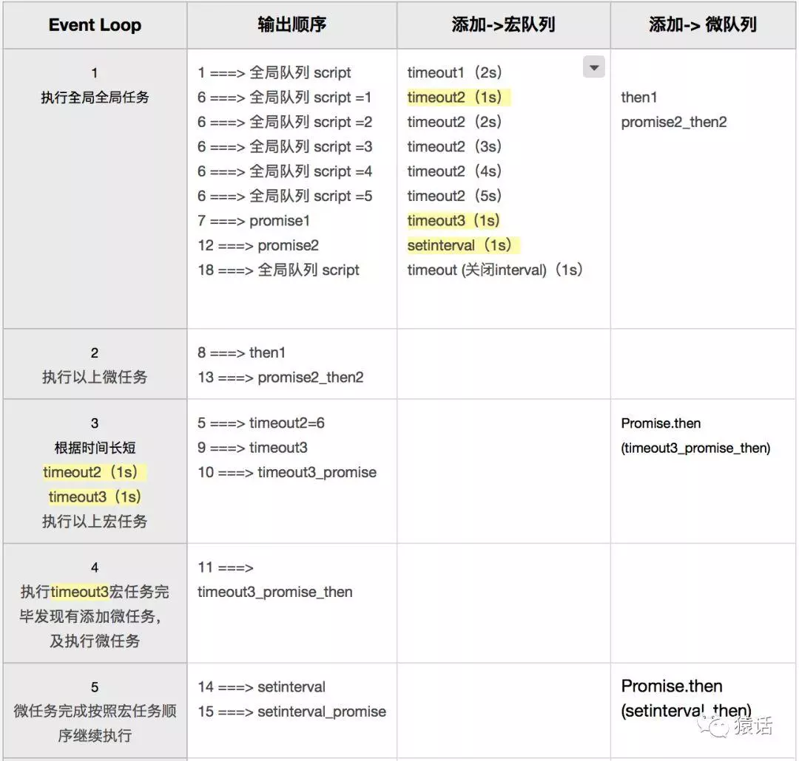

一个线程中只有**一个**事件循环。而任务队列是用来配合事件循环完成操作的，一个线程可以拥有**多个**任务队列

微观一直在执行，宏观只有在微观空了才执行


## JSON

- JavaScript 对象表示法（JavaScript Object Notation）

```js
// 将对象转换为json格式的字符串
// 返回值：一个满足json格式的 字符串
JSON.stringify(对象);

// 将json格式的字符串转换为对象
// 返回值：依赖于你的json格式字符串，可能返回数组，或者是对象....
JSON.parse(json格式字符串);
```


## cookie/session

- 会话跟踪技术

## git/svn


## MV*

​			

​			不管是哪一种mv模式，有一点是十分重要的，那就是这个事物的存在是由需求推动的，不是谁脑子一热想出来的，从这一点去理解 mvc 和 mvvm 就好多了。

```js
// 首先，为什么有这两种模式 普通的不好吗（什么需求导致的）
// 不分离，代码的复用性会很差，仅仅只是一小个修改都要重写，
// 分离，提高代码的复用性，只是把它拿出来给别人，不管别人怎么操作，可以给很多人
// 拿到一个东西，就开始操作，不管怎么拿到的，可以从很多地方拿

// mvc
// 需要数据所以有了 M
// 需要界面所以有了 V
// 需要找一个地方把 M 赋值给 V 来显示，所以有了 C

// c 的职能 
// 1、self.view用来作为所有视图的容器
// 2、管理自己的生命周期
// 3、处理Controller之间的跳转
// 4、实现Controller容器

// mvvm 
// 需要数据所以有了 M
// 需要界面所以有了 V
// 需要解析数据所以有了 VM
// 需要找一个地方把 VM 赋值给 V 来显示，所以有C（c还是存在的，只是存在感弱化了，不那么直接了）


// mvc 和 mvvm 二者的差别不是很大，mvvm 中考虑了 数据解析，细化了 m => v 的过程，不是简单的把 m 给 v，就可以，还需要对数据进行解析，否则不识别，无法使用
// 所以是因为mvc进行的分离不够细致，不够全面，而mvvm 优化了这个部分
// 发散思维，可能过个十几年 mvvm 也会逐渐淘汰，因为以后可能会有新的需求，要产生新的分类，而这个分类是 mvvm 在设计之初没有考虑到的
```


- ### MVVM

  - 在 mvvm 中 c 并不是不存在了，只是他的存在感弱化了，c不在直接持有m，而是由vm持有m，而c 持有 vm，vm将从m中获取的数据整理好交给c

- ### MVP

  - MVP由 MVC演化而来，大体相同
  - 在 MVP 中 View 并不直接使用 Model，它们之间的通信是通过 Presenter 来进行的，所有的交互都发生在 Presenter 内部
  - MVC 中 View 会直接从 Model 中读取数据而不是通过 Controller

  ```js
  // 1 - View 与 Model 完全隔离
  
  // 2 - Presenter与View的具体实现技术无关
  // 主持人
  
  // 3 - 可以进行View的模拟测试(单元测试)
  ```


- ### MVC

- v中是由需要用到m的，导致了代码的复用性变差，而且v变得越来越臃肿，所以有了mvp

- 单向通信

- C的功能

  - 1、管理自己的生命周期；2、处理Controller之间的跳转；3、实现Controller容器

  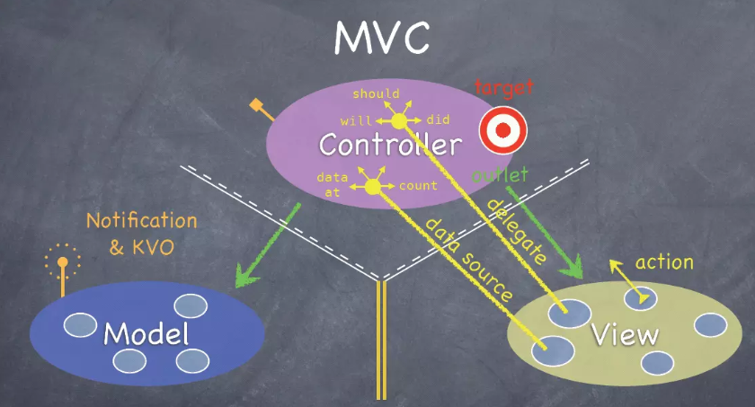


## 兼容


## 虚拟DOM

- 浏览器渲染流程（不同的浏览器不一样，这是大概流程）：

​			创建DOM树 — 创建StyleRules — 创建Render树 — 布局Layout — 绘制Painting

​			构建DOM树是一个渐进过程，为达到更好用户体验，渲染引擎会尽快将内容显示在屏幕上。它不必等到整个HTML文档解析完毕之后才开始构建render数和布局。Render树是DOM树和CSSOM树构建，这三个过程在**实际进行**的时候不是完全独立，而是会有交叉。会造成一边加载，一遍解析，一遍渲染的工作现象。

​			所以：假如在一次操作中，我需要更新10个DOM节点，浏览器收到第一个DOM请求后并不知道还有9次更新操作，因此会马上执行流程，最终执行10次，但是在这个过程中，当前一次计算完成坐标等一些信息时，后一次更新已经到来，要重新计算，这样就使前一次的计算失去了意义，白白浪费资源

   - 使用虚拟 DOM 的好处：虚拟 DOM 并不会立即操作 DOM，而是先把这些 **diff** 内容保存到 JS 中，最后在一次性的更新到浏览器里，页面只用重新渲染一次，而且操作 内存中的 js 速度明显更加快速
   - 虚拟DOM中只会记录修改页面DOM结构，具体的数据计算不进行，直接交由浏览器，让浏览器去渲染
   - 虚拟DOM

```php+HTML
<!-- 真实DOM -->
<div id="real-contriner">
    <p>Real Dom</p>
    <div>cannot updata</div>
    <ul>
        <li className="item">Item 1</li>
        <li className="item">Item 2</li>
        <li className="item">Item 3</li>
    </ul>
</div>
```
```js
// js 模拟 虚拟DOM
const tree = Element('div',{ id: 'virtual-container'},[
	Element('p',{},['Virtual Dom']),
	Element('div',{},['before update']),
	Element('ul',{},[
		Element('li',{class: 'item'},['Item 1'])
		Element('li',{class: 'item'},['Item 2'])
		Element('li',{class: 'item'},['Item 3'])
	]),
])

const root = trnn,render()
document.getElementById('virtualDom').appendChild(root)
```

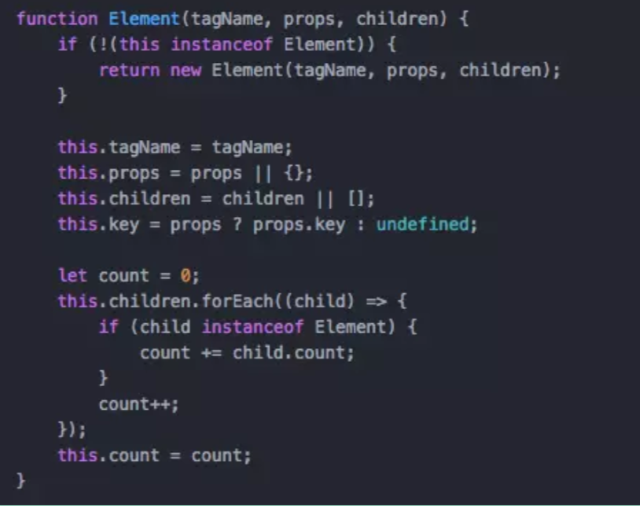


怎么更新修改虚拟 DOM

- 平层Diff
  - **节点类型变化**                                                     **REPLACE**
  - **节点类型不变，属性或属性值变化**                 **PROPS**
  - **文本变化**                                                             **TEXT**  
  - **移动／增加／删除 子节点**                                **REORDER**
    - 这一条，在v-for中写key值得原因，拥有唯一标识，可以快速的实现虚拟dom的对比替换


## 数组

### 判断数组/对象

- 判断是数组还是对象（5种）

```js
let arr = [];
let obj = {};

// 1 - length
arr.length

// 2 - constructor
arr.constructor === Array

// 3 - Array.isArray('参数')
Array.isArray(arr)  // true

// 4 - instanceof
arr instanceof Array    //true
obj instanceof Array    //false

// 5 - Object.prototype.toString.call(arr)
Object.prototype.toString.call(arr) === '[object Array]'  // true
```


### 数组去重

一般都在后端sql去重完了再返回的，节省http资源

可简单也可复杂：考虑数据类型

```js
[
 1, 1, 0, 0, 15,15, 'a', 'a', 
 'true','true',true,true,false,false, 
 undefined,undefined, null,null, NaN, NaN,
 'NaN','NaN', {},{}
]
```

- _.uniq(array)                   ---- loadsh

- set对象，是伪数组，要使用 [ ] 包裹或  Array.from()  转为数组

  ```js
  let newArr = [...new Set(arr)]
  let newArr2 = Array.from(new Set(arr))
  ```

- 遍历查找 indexOf()

- 对象属性，再遍历对象

  ```js
  // filter
  let newArr = arr.filter(item => {
     return item = obj[item] ? '': obj[item] = 1 ;
  })
  
  ```


### 扁平化

```js
// 简单方法
arr.toString().split(',')


// 
Array.prototype.flatten1 = function () {
    var resArr = []
    this.forEach(function (item) {
        Object.prototype.toString.call(item) == '[object Array]' ? resArr = resArr.concat(item.flatten1()) : resArr.push(item)
    })
    return resArr
}

//
const flatten2 = (arr)=>{
    let resArr = []
    arr.forEach(item=>Object.prototype.toString.call(item) == '[object Array]' ? resArr = resArr.concat(flatten2(item)) : resArr.push(item))
    return resArr
}

// 转为字符串，
```


## 拷贝

- 当B是拷贝A而来

  如果 A 变了 B 跟着变（浅拷贝）

  如果 A 变了 B 不变   （深拷贝）

- 遍历所有层级

  ```js
  //使用递归的方式实现数组、对象的深拷贝
  function deepClone1(obj) {
    //判断拷贝的要进行深拷贝的是数组还是对象，是数组的话进行数组拷贝，对象的话进行对象拷贝
    var objClone = Array.isArray(obj) ? [] : {};
    //进行深拷贝的不能为空，并且是对象或者是
    if (obj && typeof obj === "object") {
        
      for (key in obj) {
          
        if (obj.hasOwnProperty(key)) {
            
          if (obj[key] && typeof obj[key] === "object") {
            objClone[key] = deepClone1(obj[key]);
          } else {
            objClone[key] = obj[key];
          }
            
        }
          
      }
        
    }
    return objClone;
  }
  ```

  

- JSON.parse/JSON.stringify()（对于函数，正则无法拷贝到）

  ```js
  // JSON
  function(value) {
  	return JSON.parse(JSON.stringify(value))
  }
  ```

  

-  $\.extend( [deep ], target, object1 [, objectN ] )

- _.cloneDeep(value)


## 排序算法

## Hash

很多 hash 算法都要求一个密钥，算法根据提供的这个密钥来进行加/解密操作，对于一些没有密钥的加密方式（如MD5）则加密过程是不可逆的，

- MD5（可以加盐）
- Base64/Base64URL


## 递归

- **尾递归** 

当对于递归函数的调用时最后一条语句时（也就是说递归结束，向外跳出时不会再执行任何代码），称为尾递归，对效率的优化有很大的。

尾递归出现后，新的递归函数执行栈将会在原有位置覆盖就的函数栈，而不是再开一个新的调用栈，因为没有必要（没有保存旧的空间的必要，结束之后不用执行什么代码）不会造成栈溢出


## 导入/导出规范

CommonJS，ES6，AMD，CMD，UMD


### ES6

- 静态化，编译时导入，因此**不能放到执行代码**中，导入语句必须放到文件的头部

- **关键字**：**1 - export            2 - import**

```js
// 不会覆盖
// 导出默认
// 最多只能有一个 export default
export default 任何数据

// 加载默认
import foo from './foo'

// 按需导出多个 
// export 按需导出的数据必须有名字(必须要声明) 
// 可以有多个
export const num = 10
export var str = 11
export function fn() {
    console.log('导出一个函数')
}

// 按需加载加载，不是解构
// 可以用 as 起别名
import { num, fn } from './foo'
// 降低程序内存占用
// 有利于打包结果优化

// **注意**
// export default 可以和 export 一起共存，两种导出的加载方式不一样，可以同时导入
import foo from './foo'
import { num, fn } from './foo'
//
import { * as obj } from './foo'
// obj 是一个对象，所有的都引入了，不论是不是 default
// 下列特殊语法中的 a b c 会在 obj 中的一个属性

// 特殊语法
const a = 1
const b = 1
const c = 1
// 对于先定义的数，要用{}包起来导出
// **不是对象简写**，而是特殊语法，只能这么写
export {
	a,
    b
}
export {
	c
} // 不能 export c
```

- 注意：当一个文件中没有任何导出动作之，可以直接 import （'腻子脚本'，在一些补丁，兼容等只需要自执行，且在逻辑代码前时）

  ```js
  // 直接引入整个文件
  import './foo.js'
  ```


### CommonJS

- Node应用是由模块组成的，采用的是 CommonJS 模块规范，
- 理论上导入语句可以放到程序中的任何位置
- **关键字**：**1 - module    2 - exports    3 - require** 
```js 
CommonJS 模块中，一个文件就是一个模块，有自己的作用域自己的文件中定义的东西外部不可见
// module.exports 和 exports 是不同的两个东西
// exports 和 module都可以理解为 CommonJS 的内置对象
// module 指向文件
// exports 指向 module.exports


// 1 -- 一个对象 module 是用来表示当前文件所代表模块
// exports 是 module 的一个属性
** module.exports属性 对外接口，其他文件加载模块其实是加载 module.exports 这个属性
** (可以理解为复数属性，所以加s，导出的东西很多) 


var x = 5;
var addX = function (value) {
  return value + x;
};
module.exports.x = x;
module.exports.addX = addX;

// 2 -- exports
** Node为每个模块提供一个exports变量，指向module.exports。这等同在每个模块头部，有一行这样的命令

var exports = module.exports;
// 这样意味着是可以修改其指向的，但是我们不能这么做
// 只能添加属性，不能整体赋值

** 我们可以直接在 exports 对象上添加方法，表示对外输出的接口，如同在module.exports上添加一样
** 将 exports 变量指向一个值，等于切断了exports与module.exports的联系，将失效
```


## 模板引擎

### 使用

- 1 - 引入文件
- 2 - 写模板 + 数据 {{ }}
- 3 - 调用模板 合成字符串（参数要求是 id + 对象类型）
- 4 - 赋值（要可以解析 html）

```js
    <!-- ----------------------- 使用模板引擎-1.加载js文件 -->
    <script src="./assets/template-web.js"></script>

    <!-- ----------------------- 使用模板引擎-2.设置模板 -->
    // 一定好指定 id 和 type（text/html）
    <script id="test" type="text/html">
        <h1>{{title}}</h1>
    </script>

    <script>
        <!-- -------------------- 使用模板引擎-3.调用template函数 -->
        // ** 调用 template(模板id,  Object)  两个参数，
        // 一个 模板id ，一个数据 data 该值必须为一个js **对象**
        var html = template('test', {
            title: '这是模板引擎的例子'
        });

        // 得到一个字符串，可打印，可设置
        console.log(html);
        document.body.innerHTML = html;
	</script>
```

### 语法

- 输出普通数据（字符串、数值等）

    ```js
    // 模板写法，直接使用传入对象的 键值
    {{ str }}
    
    // template函数写法
    var html = template('id', {
        str: 'hello world'
    });
    ```


- 条件语句

    ```js
        // 模板写法
        {{if age > 18}}
            大于18
        {{else}}
            小于18
        {{/if}}
    
    ```


- 循环语句

    ```js
    	// 在循环内的数据要加 $ 
        {{each arr}}
            {{$index}} -- 数组的下标
            {{$value}} -- 数组的值
        {{/each}}
    
        // template函数写法
        var html = template('id', {
            arr: ['apple', 'banana', 'orange']
        });
    ```


### 案例

```html
	<script src="./assets/template-web.js"></script>

    <!--  定义模板 -->
    <script id="abc" type="text/html">
        <h1>{{name}}</h1>
        <p>我是{{nickname}}，我有一辆{{car}}，我今年{{age}}岁了</p>
        
        {{if age >= 18}}
            <p>欢迎~</p>
        {{else}}
            <p>禁止进入</p>
        {{/if}}
        
        <p>我有好几个朋友，分别是：</p>
        <ul>
        
            {{each girls}}
            <li>{{$index}} -- {{$value}}</li>
            {{/each}}
            
        </ul>
    </script>

    <script>
        // 调用template函数
        var str = template('abc', {
            name: '狗哥',
            nickname: '北狗最光阴',
            car: '宝马',
            age: 31,
            girls: ['王婆', '金莲', '西门大官人', '李师师', '赛金花']
        });
		
        // 赋值 使用
        document.body.innerHTML = str;
    </script>
```


## 坐标/位置

- JS坐标的三大系列：
  - offset 系列
  - client系列
  - scroll系列

- 位置的获取和设置


 component: () => import(/* webpackChunkName: "about" */ './views/About.vue') // 按需加载 


## 多级嵌套目录


# 底部


天眼查

rong.36kr.com

猪八戒


vue 后台

vue 后台

小程序

bootstrap

jq原生


请介绍一下你自己（技术，爱好，专利，csdn）

为什么在北京工作（老家没有相关环境与生态）

你最大的缺点（慢热，需要一定的时间来适应新的事物，不过在适应完成后可以迅速进入状态，掌握到关键点）

为什么离职（受伤请假了）

职业规划（全栈，项目经理，掌握有关前后端开发的所有知识）

上一家公司的人员配置（2个前端，3个后端，1个产品经理，1个项目经理）

加班的看法（如果公司需要的话，救急不救穷）

个人亮点（自己的服务器，nodejs自己的后端）


